# 设计导读与图集

**项目**：擎天学智 · K12 用户画像推荐系统  
**文档版本**：V1.1  
**编制日期**：2026-08-07  
**修订日期**：2026-08-10  
**配套 Canvas**：旁路打开「设计导读」Canvas（见会话链接）  
**依据文档**：
- `5-软件需求规格说明书-SRS.md`（V1.1）
- `8-系统设计文档.md`
- `9-数据库设计文档.md`
- `10-接口设计文档.md`
- `6-产品原型.md` / `demo/interactive-prototype.html`

---

## 0. 如何阅读本图集（建议 20 分钟）

| 顺序 | 看什么 | 建立什么心智 |
|------|--------|--------------|
| 1 | §1 系统上下文 | 系统边界与外部依赖 |
| 2 | §2 部署与模块 | 单体里有哪些 feature |
| 3 | §3 分期 | MVP 先做什么 |
| 4 | §4～5 HITL + Pipeline | AI 与「人确认」如何分工 |
| 5 | §6 状态机 | 草稿为何不影响看板 |
| 6 | §7 ER | 数据落在哪张表 |
| 7 | §8～9 时序 | 接口如何串起来 |
| 8 | §10～11 对照与演进 | 改需求动哪；RAG/Agent 怎么加 |

**一句话总览**：顾问在企微侧边栏看 AI **草稿** → 确认后写入正式数据；管理后台看组织/客户/看板；前端 **Vue 3**；LLM 用 **DeepSeek**（`DEEPSEEK_API_KEY`）；全部跑在 **一个 FastAPI 单体 + PostgreSQL** 上。

---

## 1. 系统上下文图（C4 L1）

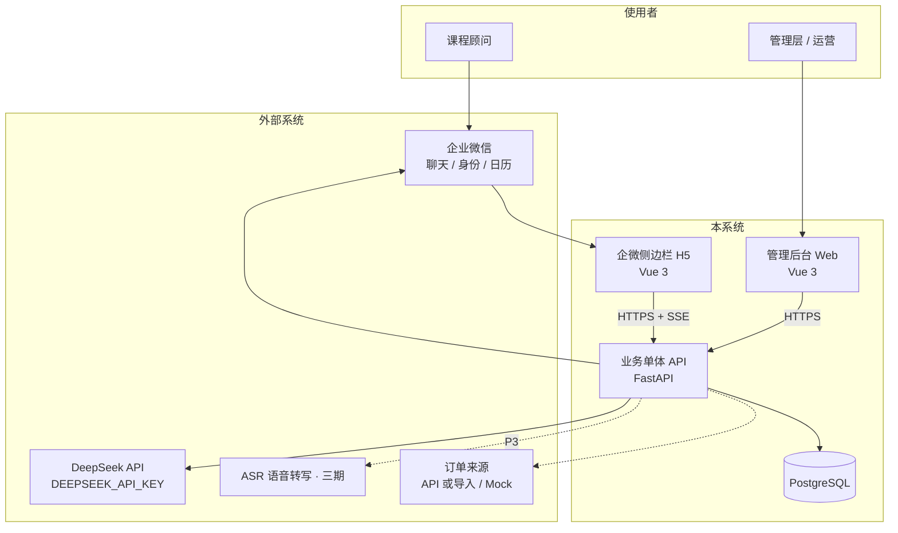

**读图要点**：
- 家长不登录本系统，只通过企微被服务。
- DeepSeek / 企微在系统外；失败时主聊天仍可用（本地可用 `MOCK_LLM`）。
- 开发期订单与消息可用 Mock，不阻塞功能验收。

---

## 2. 容器与部署图（C4 L2）

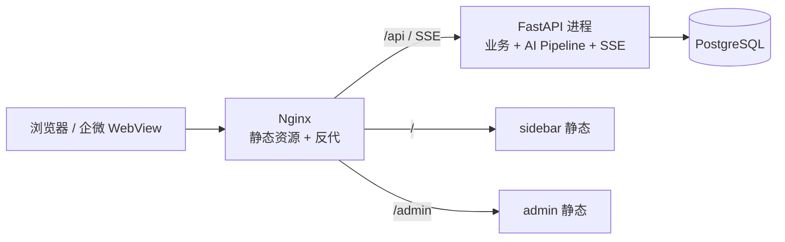

**读图要点**：MVP 单机 Docker Compose 即可；不上 K8s / 微服务 / 默认 Redis。

---

## 3. 逻辑模块图（Feature-First）

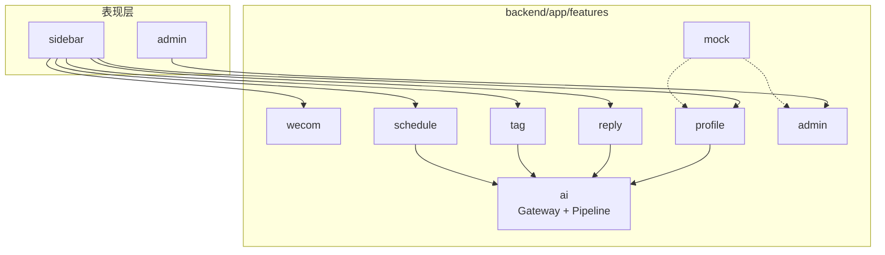

| 模块 | 一句话职责 |
|------|------------|
| wecom | 换票、外部联系人上下文、日历同步 |
| profile | 画像生成、草稿、确认 |
| reply | 话术建议与采纳埋点 |
| tag | 标签体系、打标、AI 推荐确认 |
| schedule | 待办、提醒偏好、日历 |
| admin | 组织权限、客户订单、看板、采纳率 |
| ai | Model Gateway + 各 task 的 Pipeline |
| mock | 模拟聊天/订单/Fake LLM |

---

## 4. 分期能力图（MVP / P2 / P3）

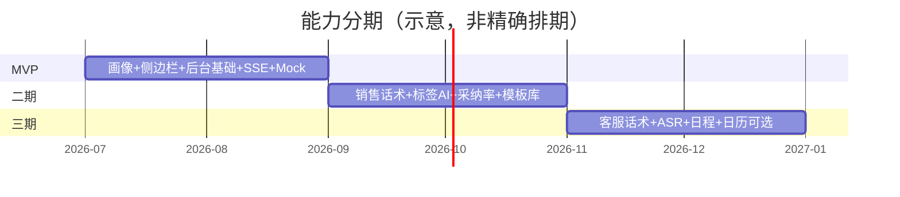

| 阶段 | 必有 | 可无 |
|------|------|------|
| MVP | 画像确认、三角色后台、SSE、手工标签、Mock | 真企微全量消息、Redis、向量库 |
| P2 | 销售话术、标签推荐、埋点报表 | Agent Loop、LangGraph HITL |
| P3 | 客服话术、ASR、日程 | 日历失败可降级站内待办 |

---

## 5. 人在环路（产品级 HITL）vs 框架 HITL

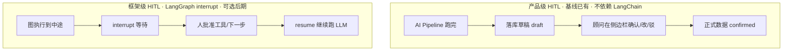

**结论**：当前需求用 **产品级 HITL（草稿 + 确认 API）** 即可；LangChain/LangGraph 的 Human-in-the-loop 留给多步 Agent，不是 MVP 刚需。

---

## 6. AI Pipeline（确定性工作流）

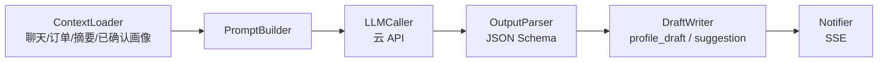

可视为 **线性 Workflow**；不是开放 Agent Loop。  
RAG 演进时在 A→B 之间插入 `Retriever` 即可，对外 API 可不变。

---

## 7. 画像状态机

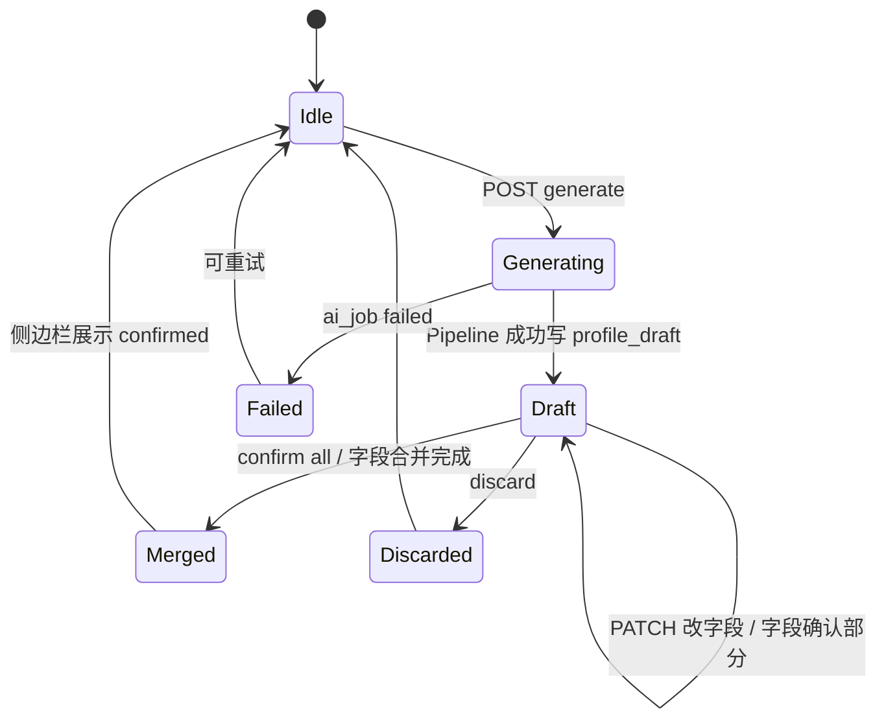

**规则**：看板与后续 Prompt **优先读 `customer_profile`（已确认）**；未确认草稿不充当正式统计。

---

## 8. 核心 ER 图

```mermaid
erDiagram
  ORG ||--o{ APP_USER : has
  ORG ||--o{ CUSTOMER : has
  APP_USER ||--o{ CUSTOMER : owns
  CUSTOMER ||--o| CUSTOMER_PROFILE : confirmed
  CUSTOMER ||--o{ PROFILE_DRAFT : drafts
  CUSTOMER ||--o{ CUSTOMER_TAG : tagged
  TAG_DEF ||--o{ CUSTOMER_TAG : defines
  CUSTOMER ||--o{ ORDER_RECORD : orders
  CUSTOMER ||--o{ CHAT_MESSAGE : messages
  CUSTOMER ||--o| CS_SUMMARY : summary
  CUSTOMER ||--o{ SUGGESTION : suggestions
  CUSTOMER ||--o{ SCHEDULE_ITEM : schedules
  CUSTOMER ||--o{ AI_JOB : jobs
  APP_USER ||--o{ EVENT_LOG : actions
  APP_USER ||--o| ADMIN_ACCOUNT : login

  ORG { bigint id PK; string name }
  APP_USER { bigint id PK; string role; bigint org_id }
  CUSTOMER { bigint id PK; string external_id; bigint owner_user_id }
  CUSTOMER_PROFILE { bigint customer_id UK; jsonb basic_info; jsonb study_info }
  PROFILE_DRAFT { bigint id PK; string status; numeric confidence }
  TAG_DEF { bigint id PK; string name; text sop_text }
  SUGGESTION { bigint id PK; string type; jsonb content }
  EVENT_LOG { bigint id PK; string action }
  AI_JOB { bigint id PK; string task_type; string status }
```

**jsonb 用途**：画像分区、建议内容、原始报文 —— **整存整取**给 UI/LLM；列表筛选走关系列（`grade`、`tag_id`、`owner_user_id`、`action`），当前不依赖 jsonb 内查询。

---

## 9. 关键时序图

### 9.1 画像生成 + 确认（MVP 主路径）

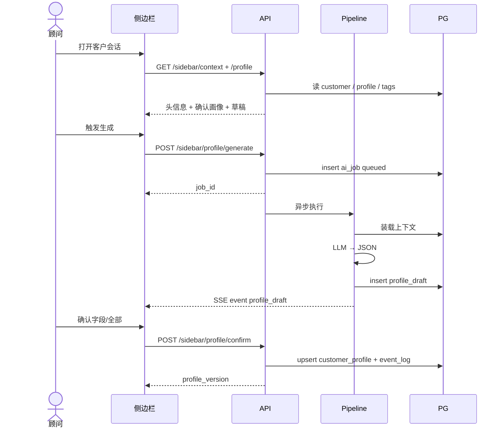

### 9.2 话术建议 + 复制（P2 · 不代发）

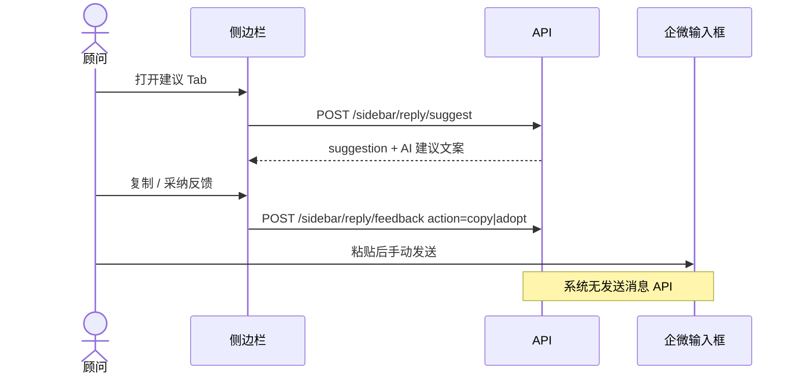

### 9.3 鉴权与数据范围

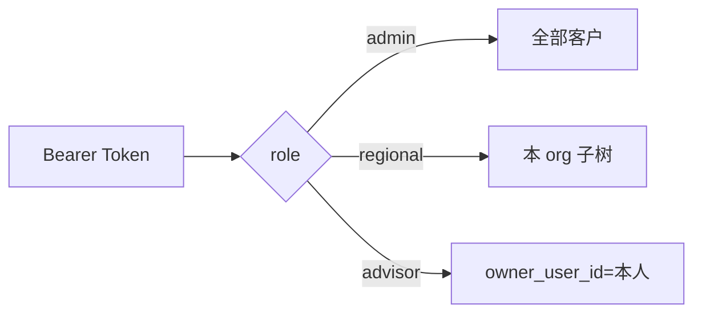

---

## 10. 模块 × 表 × 接口对照

| 模块 | 主要表 | 主要接口 |
|------|--------|----------|
| wecom / auth | app_user, admin_account | `POST /auth/wecom/exchange`, `/auth/admin/login` |
| profile | customer_profile, profile_draft, ai_job | `/sidebar/profile*` , SSE |
| reply | suggestion, script_template, event_log | `/sidebar/reply/*` |
| tag | tag_def, customer_tag, suggestion | `/sidebar/tags*` , `/admin/tags` |
| schedule | schedule_item, suggestion | `/sidebar/schedules*` |
| admin | org, customer, order_record, cs_summary | `/admin/customers|orders|users|orgs|dashboard` |
| ai | ai_job | 对内 `generate(task)` |
| mock | chat_message, order_record | `/mock/*` |
| 埋点/采纳率 | event_log | `/admin/ai/adoption` |

### 演示原型按钮 → 接口（便于联调对照）

| 原型操作 | 对应接口 |
|----------|----------|
| 打开侧边栏看客户 | `GET /sidebar/context` |
| 查看/刷新画像 | `GET /sidebar/profile` |
| 模拟 SSE 更新画像 | `POST /sidebar/profile/generate` + SSE |
| 字段确认 / 全部确认 | `POST /sidebar/profile/confirm` |
| 修改草稿 | `PATCH /sidebar/profile/draft` |
| 复制话术 | `POST /sidebar/reply/feedback` + 前端 clipboard |
| 采纳 / 不适用 | `feedback` adopt/reject |
| 确认添加/移除标签 | `POST /sidebar/tags/recommend/confirm` |
| 确认日程 | `POST /sidebar/schedules/confirm` |
| 后台看板 | `GET /admin/dashboard/summary` |

---

## 11. RAG / Agent 演进叠加图（扩展而非推翻）

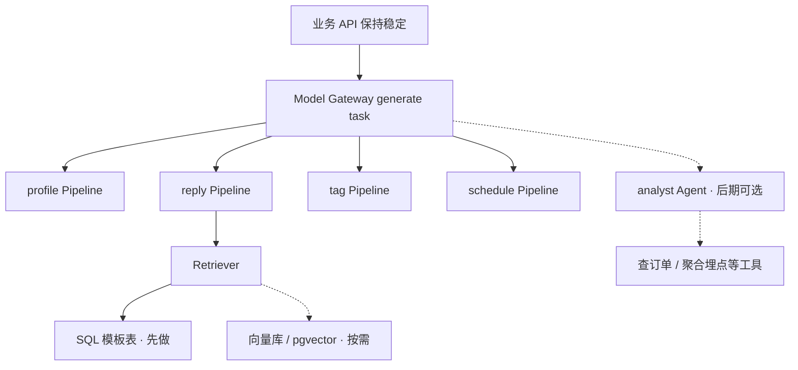

| 演进 | 库表 | 接口 |
|------|------|------|
| RAG | 可加 `kb_chunk` / embedding；可不改客户主表 | `reply/suggest` 可不变；可选 `/admin/knowledge` |
| Agent | 复用 `ai_job`，可选 `agent_step` | **新** task/API；勿把 profile/reply 改成开放 Loop |

---

## 12. 关键设计决策卡

| 决策 | 选择 | 为什么 |
|------|------|--------|
| 前端 | Vue 3 + TypeScript | 侧边栏与后台同栈，已拍板 |
| LLM | DeepSeek（`DEEPSEEK_API_KEY`） | 云 API、OpenAI 兼容；Gateway 可换模型 |
| 应用形态 | Minimal Monolith | 小团队、控成本、易联调 |
| AI 编排 | 自研 Pipeline | 路径固定、JSON 强约束；LangGraph 可选 |
| HITL | 业务草稿确认 | 对齐「重建议轻代劳」；非图内 interrupt |
| 主库 | PostgreSQL + 部分 jsonb | 半结构化画像/建议；筛选用关系列 |
| 实时 | SSE | SRS 明确；实现简单 |
| 消息来源 | Mock 可验收 | 降低企微联调阻塞 |
| 不做 | 微服务、安全专项、NFR SLA、代发 | 防自埋坑 |

---

## 13. 自测检查清单（读懂了吗？）

- [ ] 能说出侧边栏与管理后台如何共用一个 API 单体  
- [ ] 能解释草稿与已确认画像分别进哪张表、谁进看板  
- [ ] 能画出 Pipeline 五步，并说明 RAG 插在哪  
- [ ] 知道为何没有「代发消息」接口  
- [ ] 能指出 MVP 最小闭环包含哪几张表、哪几个 API  
- [ ] 能区分产品 HITL 与 LangGraph HITL  

---

## 14. 修订记录

| 版本 | 日期 | 说明 |
|------|------|------|
| V1.0 | 2026-08-07 | 首版图集 + 导读路径 |
| V1.1 | 2026-08-10 | 标注 Vue 3 前端与 DeepSeek（`DEEPSEEK_API_KEY`） |

---

*图中细节若与 `9`/`10` 字段级文档冲突，以库表/接口文档为准，并回写更新本图集版本号。*
