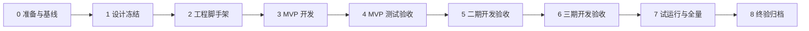

# 全量开发流程文档

**项目**：擎天学智 · K12 用户画像推荐系统（智能销售辅助系统）  
**文档版本**：V1.1  
**编制日期**：2026-08-10  
**编制目的**：按 `ClassDoc` 已定基线，给出从立项到终验的**可执行开发全流程**，标明每一步做什么、产出什么、对应哪些功能与验收点，供研发排期与逐项勾选落地。

**输入基线（ClassDoc）**：

| 编号 | 文档 | 用途 |
|------|------|------|
| 1 | `1-软件工程.md` | 里程碑骨架 |
| 2 | `2-设计模式.md` | 分层 / Pipeline / Adapter 等落地约束 |
| 3 | `3-客户需求纪要.md` | 原始诉求 |
| 4 | `4-架构思想.md` | 单体 + Feature-First + Pipeline |
| 5 | `5-软件需求规格说明书-SRS.md` | 功能需求与验收 |
| 6 | `6-产品原型.md` + `demo/interactive-prototype.html` | UI/交互基线 |
| 7 | `7-需求确认单.md` | 基线签字 |
| 8 | `8-系统设计文档.md` | 架构与模块 |
| 9 | `9-数据库设计文档.md` | 表结构 / DDL |
| 10 | `10-接口设计文档.md` | API / SSE |
| 11 | `11-设计导读与图集.md` | 图示与对照 |

**技术选型（已定）**：侧边栏/后台前端 **Vue 3 + TypeScript** + FastAPI 单体 + PostgreSQL + SSE + **DeepSeek**（环境变量 `DEEPSEEK_API_KEY`）；Docker Compose 部署；Mock 可验收。

**明确不做（全程勿扩展进验收）**：微服务/K8s、AI 代发消息、数据安全专项、NFR 量化 SLA。

---

## 0. 如何使用本文档

1. **按阶段推进**：阶段 0→8；未完成上一阶段门禁，不进入下一阶段。  
2. **按分期交付功能**：MVP → 二期(P2) → 三期(P3) → 试运行 → 全量。  
3. **每条步骤含**：操作说明 / 实现要点 / 对应需求编号 / 完成判据。  
4. **勾选方式**：`[ ]` 未做 → `[x]` 完成；阻塞项记入风险表。  
5. **冲突裁决**：接口字段以 OpenAPI（实现）为准并回写 `10`；需求以已签字 SRS 为准。

---

## 总览：阶段 × 里程碑



| 阶段 | 名称 | 门禁（通过才进入下一阶段） |
|------|------|----------------------------|
| 0 | 准备与基线 | 需求确认单签字；OPEN-01～04 有关闭计划 |
| 1 | 设计冻结 | 架构/库表/接口评审通过 |
| 2 | 工程脚手架 | Compose 可起；空库迁移成功；Hello API + 双前端壳 |
| 3 | MVP 开发 | 画像确认闭环 + 后台三角色 + SSE + Mock 演示通过 |
| 4 | MVP 测试/UAT | SRS §8.1 五条验收通过 |
| 5 | 二期 | 销售话术 + 标签 AI + 采纳率报表验收 |
| 6 | 三期 | 客服话术 + ASR + 日程/日历（可降级）验收 |
| 7 | 试运行→全量 | 30 人反馈闭环 → 约 300 人放开 |
| 8 | 终验归档 | 文档/手册/复盘齐全 |

**人力建议（对齐系统设计）**：前端 1 + 业务后端 1 + Agent 后端（组长）1 + 产品 1 + 测试兼职。

---

# 阶段 0：准备与需求基线

> 对齐软件工程「立项 + 需求基线冻结」。本项目 ClassDoc 已基本完成文档产出，本阶段重点是**签字、待决闭环、资源到位**。

## 0.1 文档与基线确认

| 步骤 | 操作 | 产出 / 判据 |
|------|------|-------------|
| 0.1.1 | 评审 SRS V1.1 功能范围与「不做」清单 | 干系人理解 M1～M6 与分期 |
| 0.1.2 | 评审原型与 `interactive-prototype.html` 主路径 | 信息架构认可 |
| 0.1.3 | 填写并签署 `7-需求确认单.md` | 功能基线冻结 |
| 0.1.4 | 建立需求变更流程（变更说明 → 双方确认 → 补丁版本） | 变更模板可用 |

## 0.2 客户配合项（OPEN）闭环计划

| 编号 | 事项 | 责任方 | 阻塞模块 | 关闭动作 |
|------|------|--------|----------|----------|
| OPEN-01 | 企微侧边栏与消息技术方案 | 双方技术 | M6 / 消息同步 | 书面确认方案 A Mock / B 会话存档 / C 手工导入 |
| OPEN-02 | 脱敏历史聊天样本 | 客户 | 画像/话术质量 | 交付样本包并入库样本目录 |
| OPEN-03 | 话术场景 + 标签体系草案 | 客户销售 | 标签/话术 | 导入 `tag_def` / `script_template` 初稿 |
| OPEN-04 | 订单/客服对接或导入方案 | 双方 | 画像多源 | 定 API 或 CSV 模板 |

**开发原则**：OPEN 未关闭时，用 Mock/导入继续开发，**不阻塞 MVP 编码**。

## 0.3 环境与账号准备

| 步骤 | 操作 |
|------|------|
| 0.3.1 | 申请云主机（建议 2～4 核 / 8～16G）或本地开发机 |
| 0.3.2 | 配置 DeepSeek：在项目根 `.env` 写入 `DEEPSEEK_API_KEY`（本地联调可先 `MOCK_LLM=true`） |
| 0.3.3 | 客户侧企微测试企业：应用、可信域名、侧边栏入口（可与开发并行） |
| 0.3.4 | 代码仓库、分支策略：`main` / `develop` / `feature/*` |
| 0.3.5 | 前端栈已定：**Vue 3 + TypeScript**（`apps/sidebar` + `apps/admin` 同栈） |

**阶段 0 完成判据**：确认单已签（或等效书面确认）；仓库与 `DEEPSEEK_API_KEY`（或 Mock）就绪；OPEN 有责任人与日期。

---

# 阶段 1：设计冻结（架构评审）

> 输入 SRS；输出已评审的系统设计 / 库表 / 接口。ClassDoc 8/9/10/11 已具备，本阶段做**评审拍板与开发任务拆解**。

## 1.1 架构决策确认（评审检查清单）

- [ ] 同意 Minimal Monolith + Feature-First，不开局微服务  
- [x] 同意前端 **Vue 3 + TypeScript**（侧边栏 + 管理后台）  
- [x] 同意 LLM 默认 **DeepSeek**（`DEEPSEEK_API_KEY`）+ Model Gateway，本地 GPU 不进 MVP  
- [ ] 同意 Mock 企微/订单用于开发与功能验收兜底  
- [ ] 同意产品级 HITL（草稿确认），不做 LangGraph interrupt  
- [ ] 同意 SSE；Nginx 关闭 buffering  
- [ ] 同意不做安全专项与 NFR SLA  

## 1.2 数据与接口冻结

| 步骤 | 操作 | 依据 |
|------|------|------|
| 1.2.1 | 确认 MVP 必建表清单 | `9` §4 |
| 1.2.2 | 确认画像草稿/已确认分离规则 | `customer_profile` + `profile_draft` |
| 1.2.3 | 确认 Scope：admin / regional / advisor | `apply_scope` |
| 1.2.4 | 确认接口分期清单 | `10` §8 |
| 1.2.5 | 确认看板漏斗简单口径（产品拍板一版） | `10` §4.6 |

## 1.3 任务拆解（WBS 入口）

按模块建看板列：`wecom` / `profile` / `tag` / `admin` / `ai` / `mock` / `sidebar-fe` / `admin-fe` / `deploy`；二期加 `reply`；三期加 `schedule` / ASR。

**阶段 1 完成判据**：评审纪要归档；前端 Vue / LLM DeepSeek 已拍板；剩余拍板项（Mock 验收、客服摘要格式等）有结论。

---

# 阶段 2：工程脚手架与开发环境

> 对齐「开发环境搭建完成」。目标：一人 `docker compose up` 可跑通空壳。

## 2.1 仓库目录落地

按系统设计创建：

```text
apps/
  sidebar/                 # 企微侧边栏 H5（Vue 3 + TS）
  admin/                   # 管理后台 Web（Vue 3 + TS）
backend/
  app/
    main.py
    core/                  # 配置、DB、鉴权、SSE、scope
    features/
      wecom/
      profile/
      reply/               # P2 再充实
      tag/
      schedule/            # P3 再充实
      admin/
      ai/                  # gateway + pipeline + prompts
      mock/
  migrations/
deploy/
  docker-compose.yml
  nginx.conf
docs/                      # 可选：指向 ClassDoc
```

| 步骤 | 操作 |
|------|------|
| 2.1.1 | 初始化 **Vue 3** 双前端（`apps/sidebar`、`apps/admin`）与后端工程、lint/format |
| 2.1.2 | FastAPI：统一响应 `{code,message,data}`、错误码表 |
| 2.1.3 | SQLAlchemy/异步引擎 + Alembic（或等价迁移） |
| 2.1.4 | 配置项：`DATABASE_URL` / `LLM_PROVIDER=deepseek` / `DEEPSEEK_API_KEY` / `LLM_MODEL` / `MOCK_WECOM` / `MOCK_LLM` / `WECOM_*` |
| 2.1.5 | Docker Compose：`api` + `postgres` + `nginx` |
| 2.1.6 | Nginx：`/` 侧边栏、`/admin` 后台、`/api` 反代；SSE 关缓冲 |
| 2.1.7 | 种子脚本入口：`POST /mock/seed/demo`（先写壳） |

## 2.2 横切能力（先于业务）

| 步骤 | 实现操作 | 对应 |
|------|----------|------|
| 2.2.1 | JWT/Bearer 中间件；`GET /auth/me` | INT 鉴权 |
| 2.2.2 | `POST /auth/admin/login` + `admin_account` | 后台登录 |
| 2.2.3 | `POST /auth/wecom/exchange`（Mock 模式可先通） | FR-SIDE-01 |
| 2.2.4 | `apply_scope(query, user)` 统一数据范围 | FR-ADMIN-02 |
| 2.2.5 | SSE Hub：`GET /sidebar/sse` + `ping` 心跳 | FR-SIDE-03 |
| 2.2.6 | Model Gateway：`generate(task,payload)`；`providers/deepseek.py` 读 `DEEPSEEK_API_KEY` + FakeLLM | ai 模块 |
| 2.2.7 | `ai_job` 异步 Task：queued→running→success/failed | 异步约定 |
| 2.2.8 | `event_log` 写入工具函数 | 埋点底座 |

## 2.3 MVP 库表迁移（一次建齐核心表）

执行 `9` 中 MVP 表 DDL（可含后续表结构占位，或分迁移）：

| 表 | 用途 |
|----|------|
| org / app_user / admin_account | 组织与三角色 |
| customer / customer_profile / profile_draft | 客户与画像 |
| tag_def / customer_tag | 标签体系与绑定 |
| order_record / chat_message / cs_summary | 多源数据 |
| event_log / ai_job | 埋点与异步任务 |

**阶段 2 完成判据**：

- [ ] `docker compose up` 成功  
- [ ] 迁移无错；可登录后台拿 token  
- [ ] Mock 换票可拿到侧边栏 token  
- [ ] SSE 能收到 `ping`  
- [ ] FakeLLM 返回固定 JSON  

---

# 阶段 3：MVP 功能开发（全量步骤）

> 范围对齐 SRS 第一阶段：画像 + 管理后台基础 + 企微侧边栏（含 SSE）。  
> 演示人设对齐原型「王女士 / 王小明 / 初二」。

## 3.A 后端 · Mock 与数据底座

| 步骤 | 实现操作 | 需求 |
|------|----------|------|
| 3.A.1 | `POST /mock/seed/demo`：组织、三角色账号、演示客户、聊天、订单、客服摘要、初始标签 | A2/A4 替代 |
| 3.A.2 | `POST /mock/messages`：写入 `chat_message` | FR-PROFILE-01 |
| 3.A.3 | `POST /mock/orders` 或后台创建订单 | FR-ADMIN-04 |
| 3.A.4 | 客服摘要：`PUT /admin/customers/{id}/cs-summary` | 多源之一 |

## 3.B 后端 · 组织 / 员工 / 权限（M5）

| 步骤 | 实现操作 | 需求 | 接口 |
|------|----------|------|------|
| 3.B.1 | 组织树 CRUD（软删） | FR-ADMIN-01 | `/admin/orgs*` |
| 3.B.2 | 员工 CRUD：角色 admin/regional/advisor、org、状态 | FR-ADMIN-01/02 | `/admin/users*` |
| 3.B.3 | 开通后台账号 `POST .../account` | FR-ADMIN-02 | 同上 |
| 3.B.4 | 所有客户/订单/看板查询套用 `apply_scope` | FR-ADMIN-02 | — |
| 3.B.5 | 越权返回 `40301` 用例自测 | FR-ADMIN-02 | — |

**角色能力验收矩阵**：

| 能力 | 超管 | 区域主管 | 顾问 |
|------|:----:|:--------:|:----:|
| 侧边栏本账号客户 | ✓ | ✓ | ✓ |
| 客户列表范围 | 全部 | 本 org 子树 | 仅本人 |
| 标签体系定义 | ✓ | 视配置 | ✗ |
| 员工权限管理 | ✓ | 有限 | ✗ |
| 看板 | 全局 | 区域 | 个人指标 |

## 3.C 后端 · 客户 / 订单 / 标签体系（M5 + M3 手工）

| 步骤 | 实现操作 | 需求 | 接口 |
|------|----------|------|------|
| 3.C.1 | 客户列表筛选（姓名/年级/标签/负责人）+ 分页 | FR-ADMIN-03 | `GET /admin/customers` |
| 3.C.2 | 客户详情：确认画像+草稿、标签、订单、近窗消息、客服摘要 | FR-ADMIN-03 | `GET /admin/customers/{id}` |
| 3.C.3 | 改负责人/年级等基础字段 | FR-ADMIN-03 | `PATCH /admin/customers/{id}` |
| 3.C.4 | 订单列表 / 单条创建 / 可选 CSV 导入 | FR-ADMIN-04 | `/admin/orders*` |
| 3.C.5 | 标签定义 CRUD + SOP 文本 + 启用 | FR-TAG-02 | `/admin/tags*` |
| 3.C.6 | 标签分布统计 | FR-TAG-05 | `GET /admin/tags/stats` |
| 3.C.7 | 侧边栏手工打标/移除 | FR-TAG-02 | `GET/POST/DELETE /sidebar/tags*` |

## 3.D 后端 · AI 画像管道（M1 核心）

Pipeline 固定五步（可单测）：

```text
ContextLoader → PromptBuilder → LLMCaller → OutputParser → DraftWriter → Notifier(SSE)
```

| 步骤 | 实现操作 | 需求 |
|------|----------|------|
| 3.D.1 | ContextLoader：已确认画像摘要 + 近 20～50 条消息 + 订单摘要 + 客服摘要 | FR-PROFILE-01 |
| 3.D.2 | PromptBuilder：四分区 JSON Schema + 置信度 + sources | FR-PROFILE-02/04 |
| 3.D.3 | LLMCaller：走 Gateway；`MOCK_LLM` 返回固定草稿 | — |
| 3.D.4 | OutputParser：校验失败重试 1 次；失败写 `ai_job.failed` | — |
| 3.D.5 | DraftWriter：写入 `profile_draft`；**不覆盖已确认字段**（仅草稿增量） | FR-PROFILE-03/05 |
| 3.D.6 | Notifier：SSE `profile_draft` / `job_failed` | FR-SIDE-03 |
| 3.D.7 | `POST /sidebar/profile/generate` 立即返回 `job_id` | FR-PROFILE-01 |
| 3.D.8 | `GET /sidebar/profile` 返回 confirmed + draft + generating | FR-PROFILE-02 |
| 3.D.9 | `PATCH /sidebar/profile/draft` 字段级手工改 | FR-PROFILE-06 |
| 3.D.10 | `POST /sidebar/profile/confirm`：fields / all / discard | FR-PROFILE-03/06 |
| 3.D.11 | confirm 时 upsert `customer_profile` + `event_log` | FR-PROFILE-03 |
| 3.D.12 | 看板/后续 Prompt **只读 confirmed** | FR-PROFILE-03 |

## 3.E 后端 · 侧边栏上下文与看板（M5/M6）

| 步骤 | 实现操作 | 需求 | 接口 |
|------|----------|------|------|
| 3.E.1 | `GET /sidebar/context`：头信息+标签摘要+weak_tip（可空） | FR-SIDE-01/02 | `/sidebar/context` |
| 3.E.2 | 看板：漏斗、续费率、顾问人效 Top（SQL 聚合或约定规则） | FR-ADMIN-06 | `/admin/dashboard/summary` |
| 3.E.3 | 企微 Adapter 壳：真实换票与 Mock 切换 | INT-01 | wecom feature |

## 3.F 前端 · 企微侧边栏（M6 + M1 + 标签查看）

对齐 `6-产品原型.md` §3.1 与演示 HTML。

| 步骤 | 实现操作 | 需求 |
|------|----------|------|
| 3.F.1 | 登录/换票：拿 token + `customer_id`；Mock 调试入口 | FR-SIDE-01 |
| 3.F.2 | 客户头区：家长/学员/年级/标签摘要 | FR-SIDE-02 |
| 3.F.3 | Tab：画像（启用）；建议/日程灰显或隐藏；标签可用 | FR-SIDE-02 |
| 3.F.4 | 画像四分区展示；「AI 建议」角标；置信度与来源 | FR-PROFILE-02/04，FR-SIDE-04 |
| 3.F.5 | 字段确认 / 修改 / 全部确认 / 忽略草稿 | FR-PROFILE-06 |
| 3.F.6 | 触发生成 + 生成中态；SSE 收 `profile_draft` 刷新 | FR-SIDE-03 |
| 3.F.7 | SSE 断线指数退避重连（尽力） | FR-SIDE-03 |
| 3.F.8 | 标签 Tab：已生效列表、SOP 只读、手工添加/移除 | FR-TAG-02 |
| 3.F.9 | **禁止**「代发消息」按钮与企微发送 API | 产品原则 |

## 3.G 前端 · 管理后台（M5）

| 步骤 | 实现操作 | 需求 |
|------|----------|------|
| 3.G.1 | 登录页 + 角色首页跳转 | FR-ADMIN-02 |
| 3.G.2 | 左导航：看板、客户、员工、订单、标签、权限（AI 分析二期再露） | 原型 §4 |
| 3.G.3 | 看板页：漏斗/续费/人效 + 区域/时间筛选 | FR-ADMIN-06 |
| 3.G.4 | 客户列表与详情（画像对比、沟通时间线、订单） | FR-ADMIN-03 |
| 3.G.5 | 员工与组织树、角色分配 | FR-ADMIN-01/02 |
| 3.G.6 | 订单列表与录入/导入 | FR-ADMIN-04 |
| 3.G.7 | 标签体系维护 + 分布图 | FR-TAG-02/05 |
| 3.G.8 | 列表统一体现 scope（用三角色账号演示差异） | FR-ADMIN-02 |

## 3.H MVP 联调与封版自测

| 步骤 | 操作 | 判据 |
|------|------|------|
| 3.H.1 | 种子数据 → 侧边栏打开王女士 → 生成画像 → SSE 到达 | 草稿可见 |
| 3.H.2 | 字段确认 / 全部确认 → 后台详情见 confirmed | 草稿不进统计 |
| 3.H.3 | 三角色分别登录后台，数据范围正确 | 403 越权 |
| 3.H.4 | 标签 CRUD + 侧边栏手工打标 + stats | 分布变化 |
| 3.H.5 | 订单关联客户后再次生成，sources 含订单 | FR-PROFILE-01/04 |
| 3.H.6 | `MOCK_LLM=false` + 配置 `DEEPSEEK_API_KEY` 冒烟真实 DeepSeek（可选） | 结构化 JSON 可解析 |
| 3.H.7 | 全文检索确认无「发送到企微」类接口 | 不代发 |

**阶段 3 完成判据（MVP 开发封版）**：§3.A～3.G 全部勾完；主路径无阻塞缺陷；可演示。

---

# 阶段 4：MVP 测试、UAT 与上线（第一阶段交付）

## 4.1 测试用例（按 SRS §8.1）

| ID | 用例 | 期望 | 对应需求 |
|----|------|------|----------|
| T-M1-01 | 多源装载后生成画像 | 草稿含四分区、置信度、来源 | FR-PROFILE-01～04 |
| T-M1-02 | 未确认前看板不把草稿当正式 | 统计不变 | FR-PROFILE-03 |
| T-M1-03 | 已确认字段再生成 | 正式字段不被静默覆盖 | FR-PROFILE-05 |
| T-M1-04 | 字段确认/驳回/改草稿 | 状态正确、有操作记录 | FR-PROFILE-06 |
| T-M5-01 | 员工组织增删改查 | 成功 | FR-ADMIN-01 |
| T-M5-02 | 三角色数据范围 | 差异可演示 | FR-ADMIN-02 |
| T-M5-03 | 客户/订单/标签/基础看板 | 可用 | FR-ADMIN-03～06 |
| T-M6-01 | 企微侧边栏（或 Mock WebView）完成主操作 | 无需跳第三方系统 | FR-SIDE-01/02 |
| T-M6-02 | SSE 通路 | 能推草稿事件 | FR-SIDE-03 |
| T-M6-03 | AI 标注文案 | 一律「AI 建议」 | FR-SIDE-04 |
| T-P-01 | 无代发 | 无发送消息 API/按钮 | 原则 |

**不测**：性能 SLA、安全专项、可用性百分比。

## 4.2 测试执行步骤

| 步骤 | 操作 |
|------|------|
| 4.2.1 | 开发自测清单签字 → 冒烟通过 → 测试准入 |
| 4.2.2 | 系统测试执行上表；缺陷分级修复（严重/主要清零） |
| 4.2.3 | 客户 UAT：用确认单 §二 MVP 关注点走查 |
| 4.2.4 | 签署 MVP 阶段验收（可阶段性签字） |

## 4.3 预发布与正式发布（MVP）

| 步骤 | 操作 |
|------|------|
| 4.3.1 | test 环境：可信域名、侧边栏入口、关闭 FakeLLM（保留 Mock 消息视 OPEN-01） |
| 4.3.2 | 部署脚本 + 回滚：镜像版本、迁移 up/down、配置备份 |
| 4.3.3 | 预发完整跑通 T-M1 / T-M5 / T-M6 |
| 4.3.4 | 生产部署：关 `MOCK_LLM`；`MOCK_WECOM` 按联调结果；监控进程与错误日志 |
| 4.3.5 | 上线记录：版本号、时间、操作人、回滚点 |

**阶段 4 完成判据**：SRS §8.1 五条全部满足；MVP 可交付客户使用（哪怕消息仍 Mock）。

---

# 阶段 5：第二期开发与验收（销售话术 + 标签 AI + 采纳率）

> 窗口计划：2026-09～10。依赖：客户话术场景与标签草案（OPEN-03）、聊天样本（OPEN-02）。

## 5.0 二期前置

| 步骤 | 操作 |
|------|------|
| 5.0.1 | 迁移：`suggestion`、`script_template`（及可选 `tag_recommend`） |
| 5.0.2 | 导入话术模板初稿到 `script_template` |
| 5.0.3 | 完善标签词表与 SOP |
| 5.0.4 | 开通侧边栏「建议」Tab；后台「AI 分析」菜单 |

## 5.A 后端 · 销售回复建议（M2 销售）

| 步骤 | 实现操作 | 需求 | 接口 |
|------|----------|------|------|
| 5.A.1 | reply Pipeline：画像要点 + 近 10 轮 + 场景模板 1～3 | FR-REPLY-01 | — |
| 5.A.2 | 场景 `sales`；学段 primary/junior/senior 进 Prompt | FR-REPLY-02/03 | — |
| 5.A.3 | 输出 1 主 + 2 备选；落 `suggestion(type=reply)` | FR-REPLY-01 | `POST /sidebar/reply/suggest` |
| 5.A.4 | 异步 + SSE `reply_ready`；`GET .../latest` | FR-SIDE-03 | 同上 |
| 5.A.5 | feedback：`copy` / `adopt` / `reject` / `edit_adopt` → `event_log` | FR-REPLY-05/06 | `POST .../feedback` |
| 5.A.6 | **永不**调用企微发消息 API | FR-REPLY-05 | — |

## 5.B 后端 · AI 标签推荐（M3）

| 步骤 | 实现操作 | 需求 | 接口 |
|------|----------|------|------|
| 5.B.1 | tag Pipeline：有效标签 + 词表 + 近窗消息 → add[]/remove[] + reason | FR-TAG-01 | — |
| 5.B.2 | 推荐以草稿 suggestion 展示，确认前不写正式标签 | FR-TAG-04 | — |
| 5.B.3 | `POST /sidebar/tags/recommend/confirm` 写入 `customer_tag` | FR-TAG-04 | 确认接口 |
| 5.B.4 | SOP 随标签详情返回供侧边栏展示 | FR-TAG-03 | `GET /sidebar/tags` |
| 5.B.5 | SSE `tag_recommend`（可选） | FR-SIDE-03 | — |

## 5.C 后端 · 采纳率报表（M5）

| 步骤 | 实现操作 | 需求 | 接口 |
|------|----------|------|------|
| 5.C.1 | 聚合 `event_log`：曝光/采纳/拒绝/编辑采纳/复制 | FR-ADMIN-07 | `GET /admin/ai/adoption` |
| 5.C.2 | 按顾问、按日、按类型（话术/标签）可下钻（至少顾问维度） | FR-ADMIN-07 | 同上 |
| 5.C.3 | 话术模板后台 CRUD | 支撑 FR-REPLY | `/admin/script-templates*` |

## 5.D 前端 · 建议 Tab + 标签推荐 + AI 分析页

| 步骤 | 实现操作 | 需求 |
|------|----------|------|
| 5.D.1 | 建议 Tab：场景切换、主/备选、「AI 建议」「不会自动发送」文案 | FR-REPLY-01/05，FR-SIDE-04 |
| 5.D.2 | 复制剪贴板；采纳/不适用/编辑后采纳 | FR-REPLY-06 |
| 5.D.3 | 标签 Tab：AI 推荐增删 + 确认/忽略 | FR-TAG-01/04 |
| 5.D.4 | 选中标签展示 SOP | FR-TAG-03 |
| 5.D.5 | 后台 AI 使用分析页 | FR-ADMIN-07 |
| 5.D.6 | 后台话术模板管理页 | — |

## 5.E 二期验收用例

| ID | 用例 | 期望 |
|----|------|------|
| T-R-01 | 同学段问题建议侧重点不同（抽检） | FR-REPLY-03 |
| T-R-02 | 复制后仅能在企微手动发 | FR-REPLY-05 |
| T-R-03 | 采纳率随操作变化 | FR-REPLY-06 / FR-ADMIN-07 |
| T-T-01 | 推荐需确认才进正式标签 | FR-TAG-04 |
| T-T-02 | 推荐理由可见 | FR-TAG-01 |

**阶段 5 完成判据**：确认单 §3.2 二期条目可演示验收；试运行前缺陷闭环。

---

# 阶段 6：第三期开发与验收（客服话术 + ASR + 日程）

> 窗口计划：2026-11～12。日历同步失败时站内待办仍可用（降级，非验收失败）。

## 6.0 三期前置

| 步骤 | 操作 |
|------|------|
| 6.0.1 | 迁移：`schedule_item`；`app_user.remind_pref` 启用 |
| 6.0.2 | 接入 ASR 云厂商；可选 OSS 存临时语音 |
| 6.0.3 | 企微日历 API 权限确认；无权限则仅站内待办 |
| 6.0.4 | 开通侧边栏「日程」Tab；建议 Tab 增加客服场景 |

## 6.A 客服回复建议 + ASR（M2 客服）

| 步骤 | 实现操作 | 需求 |
|------|----------|------|
| 6.A.1 | `scene=service` Prompt 与模板 | FR-REPLY-02（客服） |
| 6.A.2 | Gateway `transcribe(audio_ref)`；结果写入 `chat_message.asr_text` | FR-REPLY-04 |
| 6.A.3 | 转写失败前端提示；不阻断文本建议 | FR-REPLY-04 |
| 6.A.4 | 建议 Tab 展示「基于转写：…」 | 原型 §3.2 |
| 6.A.5 | 复用 feedback 埋点 | FR-REPLY-06 |

## 6.B 智能日程与提醒（M4）

| 步骤 | 实现操作 | 需求 | 接口 |
|------|----------|------|------|
| 6.B.1 | schedule Pipeline：解析时间意图 → 待办草稿 | FR-SCHED-01 | — |
| 6.B.2 | 基于历史节点生成续费/试听回访类建议（规则+LLM 均可） | FR-SCHED-02 | — |
| 6.B.3 | `GET /sidebar/schedules`：已确认 + drafts | FR-SCHED-06 | schedules |
| 6.B.4 | `POST /sidebar/schedules/confirm`：落 `schedule_item` | FR-SCHED-01 | confirm |
| 6.B.5 | `sync_calendar=true` 调企微日历；失败 `sync_state=failed` 保留站内 | FR-SCHED-03 | — |
| 6.B.6 | priority high/medium/low；强提醒（应用消息若有权限）/弱提示 SSE `weak_tip` | FR-SCHED-04 | — |
| 6.B.7 | `PATCH /sidebar/schedules/pref` 提醒偏好 | FR-SCHED-05 | pref |
| 6.B.8 | 日程列表按顾问本人视角（与 scope 一致） | FR-SCHED-06 | — |

## 6.C 前端 · 日程 Tab 与客服/语音

| 步骤 | 实现操作 | 需求 |
|------|----------|------|
| 6.C.1 | 日程 Tab：今日/本周、AI 待确认、同步状态、偏好设置 | FR-SCHED-* |
| 6.C.2 | 建议 Tab：销售/客服切换；语音转写展示 | FR-REPLY-02/04 |
| 6.C.3 | 弱提示条展示 `weak_tip` | FR-SCHED-04 |

## 6.D 三期验收用例

| ID | 用例 | 期望 |
|----|------|------|
| T-S-01 | 典型时间语句生成待办草稿 | FR-SCHED-01 |
| T-S-02 | 确认后站内可见；日历失败仍有待办 | FR-SCHED-03 |
| T-S-03 | 高/弱提醒行为可区分 | FR-SCHED-04 |
| T-S-04 | 偏好配置生效 | FR-SCHED-05 |
| T-R-04 | 语音转写后可出建议；失败有提示 | FR-REPLY-04 |
| T-R-05 | 客服场景话术侧重点不同（抽检） | FR-REPLY-02 |

**阶段 6 完成判据**：SRS 第 3 章 P2 功能条目可逐条勾选验收。

---

# 阶段 7：试运行 → 全量

| 步骤 | 操作 | 说明 |
|------|------|------|
| 7.1 | 选约 30 名顾问试运行 | 2026-12～2027-01 |
| 7.2 | 收集：画像可用性、话术风格、标签体系、打扰度 | 产品周会闭环 |
| 7.3 | 缺陷与 Prompt/模板迭代（小步） | 非功能不做 SLA 门禁 |
| 7.4 | 视 OPEN-01 推进真实消息同步（方案 B） | 与 Mock 切换开关 |
| 7.5 | LLM 费用观察：并发限制、上下文截断、确认画像缓存 | 成本控制 |
| 7.6 | 全量约 300 顾问放开（2027-02） | 培训 + 操作手册 |
| 7.7 | 稳定期 7～30 天：无重大功能故障 | 对齐软件工程试运行 |

---

# 阶段 8：终验与归档

| 步骤 | 操作 | 产出 |
|------|------|------|
| 8.1 | 对照 SRS 全功能清单做终验走查 | 验收确认单 |
| 8.2 | 交付：需求/设计/部署手册/用户手册/OpenAPI | 文档包 |
| 8.3 | 运维交接：Compose、迁移、配置项、回滚 | 运维手册 |
| 8.4 | 代码与会议/缺陷数据归档 | 归档包 |
| 8.5 | 复盘：工期、风险、OPEN 项、技术债 | 复盘纪要 |

---

# 附录 A：功能全量对照表（开发不得遗漏）

## A.1 模块 M1 — AI 客户画像

| 编号 | 简述 | 阶段 | 实现落点 |
|------|------|------|----------|
| FR-PROFILE-01 | 多源抽取 | MVP | ContextLoader + chat/order/cs |
| FR-PROFILE-02 | 360° 四分区 | MVP | JSON Schema + 侧边栏/后台 |
| FR-PROFILE-03 | 草稿→确认生效 | MVP | profile_draft / customer_profile |
| FR-PROFILE-04 | 置信度与来源 | MVP | draft 字段 + UI |
| FR-PROFILE-05 | 增量更新不覆盖已确认 | MVP | DraftWriter 合并规则 |
| FR-PROFILE-06 | 侧边栏编辑/确认/驳回 | MVP | confirm/patch API + UI |

## A.2 模块 M2 — AI 智能回复

| 编号 | 简述 | 阶段 | 实现落点 |
|------|------|------|----------|
| FR-REPLY-01 | 基于画像+上下文建议 | P2 | reply Pipeline |
| FR-REPLY-02 | 销售 / 客服场景 | P2 / P3 | scene 参数 |
| FR-REPLY-03 | 学段差异 | P2 | stage + Prompt |
| FR-REPLY-04 | 语音转写 | P3 | ASR + asr_text |
| FR-REPLY-05 | 不代发 | P2 | 无发送 API；仅复制 |
| FR-REPLY-06 | 采纳/拒绝/编辑埋点 | P2 | feedback + event_log |

## A.3 模块 M3 — AI 智能标签

| 编号 | 简述 | 阶段 | 实现落点 |
|------|------|------|----------|
| FR-TAG-01 | AI 推荐增删+理由 | P2 | tag Pipeline |
| FR-TAG-02 | 标签体系自定义 | MVP | admin tags |
| FR-TAG-03 | 关联 SOP | P2 | sop_text 展示 |
| FR-TAG-04 | 确认后生效 | P2 | recommend/confirm |
| FR-TAG-05 | 统计分析 | MVP | tags/stats |

## A.4 模块 M4 — AI 智能日程

| 编号 | 简述 | 阶段 | 实现落点 |
|------|------|------|----------|
| FR-SCHED-01 | 时间意图→待办建议 | P3 | schedule Pipeline |
| FR-SCHED-02 | 续费/试听等预测提醒 | P3 | 规则+LLM |
| FR-SCHED-03 | 同步企微日历 | P3 | calendar adapter |
| FR-SCHED-04 | 强/弱分级提醒 | P3 | priority + weak_tip |
| FR-SCHED-05 | 提醒偏好 | P3 | remind_pref |
| FR-SCHED-06 | 顾问本人视角 | P3 | scope 对齐 |

## A.5 模块 M5 — 管理后台

| 编号 | 简述 | 阶段 | 实现落点 |
|------|------|------|----------|
| FR-ADMIN-01 | 员工与组织 | MVP | orgs/users |
| FR-ADMIN-02 | 三角色权限与数据范围 | MVP | role + apply_scope |
| FR-ADMIN-03 | 客户管理与沟通回溯 | MVP | customers |
| FR-ADMIN-04 | 订单与客户关联 | MVP | orders |
| FR-ADMIN-05 | 标签管理与统计 | MVP | tags |
| FR-ADMIN-06 | 基础看板 | MVP | dashboard/summary |
| FR-ADMIN-07 | AI 采纳率 | P2 | ai/adoption |

## A.6 模块 M6 — 企微侧边栏

| 编号 | 简述 | 阶段 | 实现落点 |
|------|------|------|----------|
| FR-SIDE-01 | 聊天时展示当前客户能力 | MVP | context + WebView |
| FR-SIDE-02 | 聚合画像/建议/标签/日程 | MVP～P3 | Tab 分期开放 |
| FR-SIDE-03 | SSE 流式更新 | MVP | /sidebar/sse |
| FR-SIDE-04 | 「AI 建议」标注 | MVP | 前端文案规范 |

## A.7 集成需求

| 编号 | 对象 | 阶段动作 |
|------|------|----------|
| INT-01 | 企微侧边栏身份 | MVP Mock → test 真实换票 |
| INT-02 | 消息/会话 | MVP Mock/导入 → 并行真实方案 |
| INT-03 | 企微日历 | P3 可选同步 |
| INT-04 | 订单/客服 | MVP 导入/Mock → 对接 |
| INT-05 | DeepSeek LLM / ASR | MVP：`DEEPSEEK_API_KEY`；P3 ASR |

---

# 附录 B：接口实现清单（按阶段勾选）

## B.1 MVP

- [ ] `POST /auth/wecom/exchange`
- [ ] `POST /auth/admin/login`
- [ ] `GET /auth/me`
- [ ] `GET /sidebar/context`
- [ ] `GET /sidebar/profile`
- [ ] `POST /sidebar/profile/generate`
- [ ] `PATCH /sidebar/profile/draft`
- [ ] `POST /sidebar/profile/confirm`
- [ ] `GET /sidebar/sse`
- [ ] `GET/POST/DELETE /sidebar/tags*`（手工）
- [ ] `CRUD /admin/orgs`
- [ ] `CRUD /admin/users`（含开通账号）
- [ ] `GET/PATCH /admin/customers*`
- [ ] `PUT /admin/customers/{id}/cs-summary`
- [ ] `GET/POST /admin/orders*`（含可选 import）
- [ ] `CRUD /admin/tags` + `/admin/tags/stats`
- [ ] `GET /admin/dashboard/summary`
- [ ] `POST /mock/messages` / `/mock/orders` / `/mock/seed/demo`

## B.2 P2

- [ ] `POST /sidebar/reply/suggest`
- [ ] `GET /sidebar/reply/latest`
- [ ] `POST /sidebar/reply/feedback`
- [ ] `POST /sidebar/tags/recommend/confirm`
- [ ] `GET /admin/ai/adoption`
- [ ] `CRUD /admin/script-templates`

## B.3 P3

- [ ] `GET /sidebar/schedules`
- [ ] `POST /sidebar/schedules/confirm`
- [ ] `PATCH /sidebar/schedules/pref`
- [ ] 内部 `transcribe` + 建议链路接入
- [ ] 日历同步状态字段行为

---

# 附录 C：数据库表落地清单

| 表 | MVP | P2 | P3 |
|----|:---:|:--:|:--:|
| org | ✓ | | |
| app_user | ✓ | | remind_pref 启用 |
| admin_account | ✓ | | |
| customer | ✓ | | |
| customer_profile | ✓ | | |
| profile_draft | ✓ | | |
| tag_def / customer_tag | ✓ | | |
| order_record / chat_message / cs_summary | ✓ | | asr_text 常用 |
| event_log / ai_job | ✓ | 增强 | |
| suggestion | | ✓ | schedule 类型 |
| script_template | | ✓ | |
| schedule_item | | | ✓ |

---

# 附录 D：前端页面 / Tab 落地清单

| 界面 | MVP | P2 | P3 |
|------|:---:|:--:|:--:|
| 侧边栏 · 画像 | ✓ | | |
| 侧边栏 · 建议 | | ✓ 销售 | ✓ 客服+ASR |
| 侧边栏 · 标签 | 手工 | +AI 推荐 | |
| 侧边栏 · 日程 | | | ✓ |
| 后台 · 看板/客户/员工/订单/标签/权限 | ✓ | | |
| 后台 · AI 采纳率 | | ✓ | |
| 后台 · 话术模板 | | ✓ | |

---

# 附录 E：AI Pipeline 与 HITL 实现要点（全程遵守）

1. **产品级 HITL**：AI 只写草稿（profile_draft / suggestion / schedule draft），顾问确认后写正式数据。  
2. **确定性 Pipeline**：非开放 Agent Loop；RAG 若引入，插在 ContextLoader 与 PromptBuilder 之间。  
3. **Model Gateway**：默认 DeepSeek（`DEEPSEEK_API_KEY`）；`MOCK_LLM` 保障无 Key 可联调。  
4. **限流**：进程内并发队列（如 5～10），不上 Celery/MQ，除非试运行证明必要。  
5. **Prompt 控成本**：截断历史；优先用已确认画像摘要。  
6. **文案**：凡 AI 输出区固定「AI 建议」；话术区提示「不会自动发送」。

---

# 附录 F：每日/每周研发节奏建议（Vibe 友好）

| 节奏 | 做法 |
|------|------|
| 日 | 按 feature 文件夹交付可运行增量；FakeLLM 先通 UI |
| 周 | 演示主路径；对照附录 A 勾选；更新 OPEN 状态 |
| 联调 | 先 Mock 验收功能，真企微并行，不互相阻塞 |
| 重构 | 单模块内小步重构；禁止借机上微服务 |

**推荐编码顺序（单阶段内）**：

1. 表迁移 + Repository  
2. Service 规则（确认流 / scope）  
3. API  
4. Pipeline（可 Fake）  
5. 前端对接  
6. 真实 LLM/企微替换开关  

---

# 附录 G：风险与否决项（开发中自检）

| ID | 风险 | 应对 |
|----|------|------|
| R1 | 企微消息未开通 | Mock+导入；功能验收不阻塞 |
| R2 | LLM 费用高 | 截断、缓存、限并发 |
| R3 | 话术风格不符 | 客户模板库 + 采纳反馈改 Prompt |
| R4 | 日历 API 受限 | 站内待办保底 |
| R5 | 过早微服务/本地 GPU | **否决** |
| R6 | 把安全/NFR 写进验收 | **否决**；客户书面变更再说 |

---

# 附录 H：阶段门禁一页纸

| 门禁 | 必须满足 |
|------|----------|
| 进开发 | 确认单签字；脚手架可起 |
| MVP 封版 | 附录 A 中 MVP 行全部实现；附录 B.1 接口全绿 |
| MVP 验收 | SRS §8.1；三角色；不代发；SSE 通 |
| 进二期 | MVP 已验收或书面同意并行；话术/标签草案到位 |
| 二期验收 | 销售话术+标签确认流+采纳率 |
| 进三期 | 二期主缺陷清零；ASR/日历权限有结论 |
| 三期验收 | 客服+ASR+日程（日历可降级） |
| 全量 | 30 人试运行反馈闭环 |
| 结项 | 终验签字 + 文档归档 + 复盘 |

---

## 修订记录

| 版本 | 日期 | 说明 |
|------|------|------|
| V1.0 | 2026-08-10 | 首版：基于 ClassDoc 1～11 汇总的全量可执行开发流程 |
| V1.1 | 2026-08-10 | 前端定 Vue 3；LLM 定 DeepSeek（`DEEPSEEK_API_KEY`） |

---

*本文是执行手册，不替代 SRS/设计细节。字段级以 `9`/`10` 为准；实现中以 OpenAPI 为联调真源并回写文档。下一步建议：按「阶段 2 → 阶段 3」从脚手架直接开工。*
