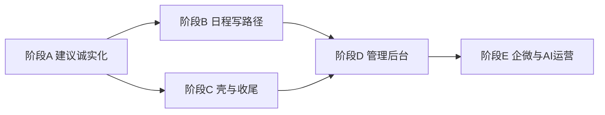

# 全端 UX / 功能缺口审计与改进计划

**项目**：擎天学智 · K12 用户画像推荐系统  
**文档编号**：ClassDoc/30  
**版本**：V1.0  
**编制日期**：2026-08-13  
**性质**：完整改进计划（先文档、后分阶段开发）  
**输入**：侧栏/后台代码审计；ClassDoc 22～29；SRS；接口文档  
**原则**：AI 不代发；优先打通「顾问真实动作」与「后端已有但前端未用」能力；每阶段同步实现/测试文档。

---

## 0. 一句话结论

后端能力整体领先于前端体验。  
**标签手工**已补齐（ClassDoc 29）；当前最大体验债在 **建议 Tab + 聊天快捷按钮歧义**，其次 **日程写路径未暴露**、**管理后台只读壳**。画像相对可用。

---

## 1. 覆盖度总表

| 模块 | 后端能力 | 前端诚实度 | 阻塞后端演示？ |
|------|----------|------------|----------------|
| 画像 Profile | 生成 / 草稿 PATCH / 分区确认 | 较高 | 低（时间线仍偏 JSON） |
| 标签 Tags | 词表 / 自定义 / AI 子集确认 | 高（29 后） | 低（推荐名不在词表时偶发丢项） |
| 建议 Reply | suggest / feedback / 备选 / 埋点 | **低** | **高**（编辑假动作、备选不可用） |
| 日程 Schedule | suggest / confirm+edits / CRUD / remind / pref | 中 | **中**（手工创建/改状态/确认前编辑未接） |
| 模拟聊天 | messages / mock / ASR | 中 | **高**（「用于话术」名不副实） |
| 工作台壳 | health / SSE / weak_tip | 中 | 低 |
| 管理后台 | 组织/员工/客户写/标签写/筛选/采纳下钻 | **低** | **高**（多模块无写 UI） |

---

## 2. 侧栏分模块问题清单

### 2.1 建议 Tab（P0）

| ID | 问题 | 后端实际 | 前端现状 | 严重度 |
|----|------|----------|----------|--------|
| R-01 | 「采纳」像发消息 | 仅 `adopted` + 埋点 | 无说明、无后续态 | 高 |
| R-02 | 「编辑后采纳」无编辑器 | 需 `edited_content` | 直接传原文 | 高 |
| R-03 | 备选无法操作 | 返回 `alternatives[]` | 只读折叠 | 高 |
| R-04 | 「不适用」语义不清 | `rejected` + 埋点，latest 不再返回 | 看起来像清空，价值不明 | 中 |
| R-05 | 反馈后空白 | latest 只含 pending/shown | 无「已采纳/已拒绝」回执 | 中 |
| R-06 | 生成依据不可见 | 近 10 条聊天 + 画像 + 模板 | 顾问以为全量历史 | 中 |

**改进要点**：主 CTA=「复制到企微」；采纳改为「标记有用」或复制后轻反馈；真正编辑区；备选可「用作主建议/复制」；反馈后结果卡；展示「基于近 10 条 + 画像 + 场景」。

### 2.2 模拟聊天（P0）

| ID | 问题 | 说明 | 严重度 |
|----|------|------|--------|
| C-01 | 「用于话术」歧义 | 未绑定气泡消息，只是切 Tab + 全量 suggest | 高 |
| C-02 | 「识别日程」同理 | 未传 message 焦点 | 高 |
| C-03 | 语音按钮语义 | Fake ASR，用输入框作 hint | 中 |
| C-04 | 缺系统行/加载更多 | 设计有、未做 | 低 |

**改进要点（二选一，计划锁定 A）**：

- **方案 A（本计划默认）**：改文案为「生成话术（全会话）」「生成日程（全会话）」；气泡可「复制本句」。  
- **方案 B（可选增强）**：后端 `suggest` 增加 `focus_message_id`，Prompt 强调该句。

### 2.3 日程 Tab（P1）

| ID | 问题 | 后端已有 | 前端缺口 | 严重度 |
|----|------|----------|----------|--------|
| S-01 | 不能手工建待办 | `POST /schedules` | 无 | 中 |
| S-02 | 不能改/完成/取消 | `PATCH /{id}` | 无 | 中 |
| S-03 | 确认前不能改标题/时间 | `confirm.edits` | 未传 | 中 |
| S-04 | 弱/强提醒不透明 | remind API | 点后才知降级 | 中 |
| S-05 | 免打扰时段 | `quiet_hours` | 无编辑 | 低 |
| S-06 | 草稿不能忽略 | 无独立 reject（可扩展 status） | 只能确认 | 低 |

### 2.4 画像 Tab（P2）

| ID | 问题 | 严重度 |
|----|------|--------|
| P-01 | timeline 仍偏原始 JSON 编辑 | 中 |
| P-02 | `field_status` 英文裸露 | 低 |
| P-03 | 已确认区只读，无「单区重生成」 | 低 |

### 2.5 标签 Tab（P2，已大部分完成）

| ID | 问题 | 严重度 |
|----|------|--------|
| T-01 | AI 推荐名不在词表时 confirm 子集可能丢项 | 中 |
| T-02 | 自定义未填 sop（有意留给后台） | 低 |

### 2.6 工作台壳（P2）

| ID | 问题 | 严重度 |
|----|------|--------|
| W-01 | 弱提示关闭仅本地，不跳转到日程 | 中 |
| W-02 | 能力条「日历降级」写死 | 低 |
| W-03 | 演示操作与产品区混杂 | 中 |
| W-04 | Toast/骨架未统一 | 中 |

---

## 3. 管理后台问题清单

### 3.1 完全未暴露（阻塞演示）

| 能力 | API | 严重度 |
|------|-----|--------|
| 组织 CRUD | `/admin/orgs*` | 高 |
| 员工创建/改 / 开账号 | `POST/PATCH users`、`POST .../account` | 高 |
| 标签体系写 | `POST/PATCH /admin/tags` | 高 |
| 客户详情叙事 | API 已返回 tags/orders/messages/cs_summary，UI 只用 profile JSON | 高 |

### 3.2 部分暴露

| 能力 | 缺口 | 严重度 |
|------|------|--------|
| 客户/员工/订单列表 | 无筛选、无翻页控件 | 中 |
| 客户 PATCH / 客服摘要 | 无 UI | 中 |
| 话术模板 | 无 PATCH 编辑，仅建+停用 | 中 |
| AI 采纳率 | 仅按顾问；无按日/日期/组织 | 中 |
| 订单创建 | 无 UI | 中 |

### 3.3 UX 基建

| 项 | 严重度 |
|----|--------|
| 无 Vue Router，刷新丢页 | 中 |
| 无空态/加载/错误统一 | 中 |
| 未引入青墨 Token / 品牌登录 | 低～中 |

---

## 4. 分阶段改进计划

与 ClassDoc 26 对齐并细化。**不代发消息**贯穿始终。

### 阶段 A — 建议诚实化 + 聊天文案（P0）【已完成 · ClassDoc/31】

**目标**：顾问能理解并完成「看建议 → 编辑 → 复制」；去掉假动作。

| 步骤 | 内容 | 端 | 状态 |
|------|------|----|------|
| A.1 | SuggestPanel：主按钮「复制到企微」；次级「有用/不适用」文案 | FE | ✅ |
| A.2 | 内联/抽屉编辑器 → 真实 `edit_adopt`；编辑稿可再复制 | FE | ✅ |
| A.3 | 备选：设为主建议 / 复制 / 标记有用 | FE | ✅ |
| A.4 | 反馈后结果卡（已采纳/已拒绝/已复制），支持「再生成」 | FE | ✅ |
| A.5 | 展示生成依据摘要（近窗条数、场景、是否含转写） | FE | ✅ |
| A.6 | 聊天按钮改文案（方案 A）；可选复制本句 | FE | ✅ |
| A.7 | ClassDoc 31 实现记录 + 冒烟清单 | Doc | ✅ |

**可选 A+**：`POST /reply/suggest` 增加 `focus_message_id`（方案 B）。

**完成判据**：无「编辑后采纳」假路径；备选至少可复制；「用于话术」文案不再误导。 — **已满足。**

---

### 阶段 B — 日程写路径补齐（P1）【已完成 · ClassDoc/32】

| 步骤 | 内容 | 状态 |
|------|------|------|
| B.1 | 手工创建待办表单 → `POST /schedules` | ✅ |
| B.2 | 列表：完成/取消/改标题时间 → `PATCH` | ✅ |
| B.3 | 草稿确认前可改 `edits` | ✅ |
| B.4 | 弱/强前提示与结果 Toast；quiet_hours 简单编辑 | ✅ |
| B.5 | 草稿「忽略」→ `POST /dismiss` | ✅ |
| B.6 | 文档 + 冒烟 | ✅ |

---

### 阶段 C — 侧栏壳与体验收尾（P1/P2）

| 步骤 | 内容 |
|------|------|
| C.1 | 统一 Toast / 空态 / 按钮 loading |
| C.2 | 弱提示点击跳转日程；能力条与真实 sync/health 对齐 |
| C.3 | 演示控件收入「演示模式」折叠区 |
| C.4 | 画像 timeline 结构化编辑；状态中文 |
| C.5 | 标签推荐名不在词表时提示「需先建词条/跳过」 |

---

### 阶段 D — 管理后台产品化（P1，可与 B/C 并行后半）

| 步骤 | 内容 |
|------|------|
| D.1 | 青墨 Token + 品牌登录壳 |
| D.2 | Vue Router：看板/客户/组织员工/订单/标签/话术/AI |
| D.3 | 客户详情：左画像（确认/草稿）右沟通时间线+订单+标签+客服摘要 |
| D.4 | 组织 CRUD；员工创建/改/开账号 |
| D.5 | 标签 POST/PATCH；话术 PATCH |
| D.6 | 列表筛选 + 分页；AI 采纳按日/区间 |
| D.7 | 空态/错误；文档 ClassDoc 3x |

---

### 阶段 E — 真实企微 / AI 运营（原 26 阶段 4～5）

| 步骤 | 内容 |
|------|------|
| E.1 | OPEN-01 消息同步；Mock 开关产品化 |
| E.2 | Prompt 版本、禁止静默 Fake 回退配置、模板 upsert |
| E.3 | 真实 ASR / 日历（权限到位后） |

---

## 5. 推荐实施顺序

**建议下一迭代：阶段 C（壳与收尾）或 D.1～D.3（管理后台可讲客户故事）。**  
阶段 A（ClassDoc/31）、阶段 B（ClassDoc/32）已交付。

---

## 6. 明确不做（本计划边界）

- 企微代发 / 群发  
- 开局微服务  
- 安全/SLA 专项  
- 侧栏深度改全局标签 SOP（后台维护）  
- 为演示强行上真实 ASR/日历厂商（属阶段 E）

---

## 7. 文档与产出索引

| 文档 | 用途 |
|------|------|
| ClassDoc/30（本文） | 全端审计 + 改进计划 |
| ClassDoc/26 | 总阶段规划（应引用本文细化） |
| ClassDoc/29 | 标签手工（已完成） |
| ClassDoc/31 | 阶段 A：建议诚实化 + 聊天文案 |
| ClassDoc/32 | 阶段 B：日程写路径补齐 |
| ClassDoc/33+ | 后续各阶段实现/测试 |

---

## 8. 验收总则（每阶段通用）

1. 非技术顾问能说清每个主按钮「点了会发生什么」。  
2. 凡有反馈/确认，UI 有明确结果态，不只静默。  
3. 后端已有写接口不得长期「只测 Postman」。  
4. `npm run build` + 相关 smoke；不破坏 P3 主路径。  
5. 同步更新接口说明与阶段开发记录。

---

## 修订

| 版本 | 日期 | 说明 |
|------|------|------|
| V1.0 | 2026-08-13 | 首版全端审计与分阶段改进计划 |
