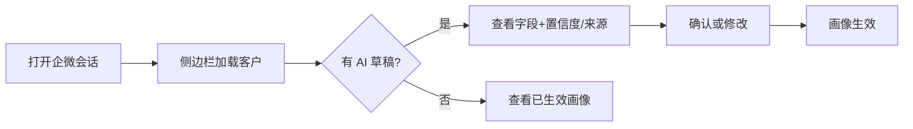
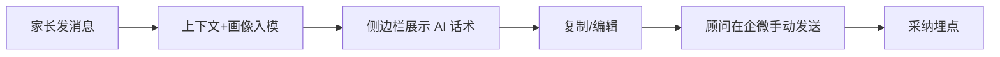
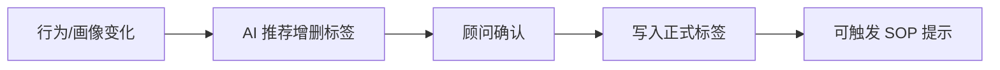

# 产品原型说明（轻量化）

**项目**：K12 用户画像推荐系统  
**版本**：V1.0  
**关联 SRS**：`5-软件需求规格说明书-SRS.md`（V1.2）  
**说明**：本文档以线框 + 交互说明表达原型，供评审确认；正式实现采用 **Vue 3**（侧边栏 + 管理后台），可在此基线上用 Figma 等工具细化高保真。原型用于**功能**演示与确认；不包含性能 SLA、数据安全专项等非功能硬性要求（见 SRS §4）。

---

## 1. 原型范围与分期

| 界面 | MVP | 二期 | 三期 |
|------|:---:|:---:|:---:|
| 企微侧边栏 · 画像 | ✓ | ✓ | ✓ |
| 企微侧边栏 · 回复建议 | | ✓ | ✓ |
| 企微侧边栏 · 标签 | 查看/手工 | ✓ AI 推荐 | ✓ |
| 企微侧边栏 · 日程 | | | ✓ |
| 管理后台 · 组织/权限/客户/订单/标签 | ✓ | ✓ | ✓ |
| 管理后台 · 基础看板 | ✓ | ✓ | ✓ |
| 管理后台 · AI 采纳率 | | ✓ | ✓ |

---

## 2. 信息架构

```
企业微信侧边栏 H5                 管理后台 Web
├─ 客户头区（姓名/年级/标签摘要）   ├─ 登录 / 角色首页
├─ Tab: 画像                      ├─ 数据看板
├─ Tab: 建议（二期）               ├─ 客户管理 → 画像/沟通记录
├─ Tab: 标签                      ├─ 员工与权限
├─ Tab: 日程（三期）               ├─ 订单管理
└─ 弱提示条（提醒/新草稿）         ├─ 标签体系
                                  └─ AI 使用分析（二期）
```

---

## 3. 企微侧边栏原型

### 3.1 整体布局（MVP）

```
┌─────────────────────────────────────┐
│ 家长：王女士 · 学员：王小明 · 初二    │
│ 标签：高意向 | 数学薄弱     [更多]   │
├─────────────────────────────────────┤
│ [画像]  建议   标签   日程           │  ← Tab；建议/日程按期灰显或隐藏
├─────────────────────────────────────┤
│                                     │
│  ★ AI 建议（草稿）  置信度 82%       │
│  来源：近 14 日聊天 · 订单#1024      │
│                                     │
│  ▸ 基本信息                         │
│    学校：××中学  年级：初二          │
│    [确认] [修改]                    │
│                                     │
│  ▸ 学情分析                         │
│    弱科：数学 · 目标：小升初冲刺…    │
│    [确认] [修改]                    │
│                                     │
│  ▸ 沟通偏好                         │
│    晚 20–22 点回复率高 · 价格敏感…   │
│    [确认] [修改]                    │
│                                     │
│  ▸ 跟进时间线                       │
│    06-20 咨询试听 → 06-25 试听…     │
│                                     │
│  [全部确认生效]  [忽略本次草稿]      │
└─────────────────────────────────────┘
│ 弱提示：明日 10:00 试听回访（若有）  │
└─────────────────────────────────────┘
```

**交互要点**：

1. 打开会话 → 侧边栏自动加载当前外部联系人客户。  
2. 有新 AI 草稿时，对应字段高亮，并标注「AI 建议」。  
3. 字段级确认；「全部确认」将草稿写入已生效画像。  
4. SSE：分析进行中显示流式进度（如「正在更新学情…」）。  

### 3.2 回复建议 Tab（二期）

```
┌─────────────────────────────────────┐
│ [画像] [建议] 标签  日程             │
├─────────────────────────────────────┤
│ 场景：[销售 ▼]  学段：初中（自画像）  │
│                                     │
│ ★ AI 建议话术（不会自动发送）         │
│ ┌─────────────────────────────────┐ │
│ │ 王女士您好，结合小明近期数学薄弱… │ │
│ │ …可以先安排一次诊断试听…         │ │
│ └─────────────────────────────────┘ │
│ [复制] [编辑] [采纳并记录] [不适用]   │
│                                     │
│ 备选 2 · 备选 3（可展开）             │
│                                     │
│ 语音消息：已转写「想问问初二数学…」   │
└─────────────────────────────────────┘
```

**交互要点**：

- 复制到剪贴板，由顾问在企微输入框粘贴发送（不代发）。  
- 「采纳 / 不适用」写埋点；编辑后使用记为「编辑采纳」。  

### 3.3 标签 Tab

```
┌─────────────────────────────────────┐
│ 已生效标签                           │
│  [高意向 ×] [数学薄弱 ×] [初中]      │
│                                     │
│ ★ AI 推荐变更                        │
│  + 添加「近期决策」  理由：连续3天…  │
│    [确认添加] [忽略]                 │
│  − 移除「刚加微信」  理由：已试听…   │
│    [确认移除] [忽略]                 │
│                                     │
│ [+ 手工添加标签]                     │
│ 选中标签可查看跟进 SOP 摘要           │
└─────────────────────────────────────┘
```

### 3.4 日程 Tab（三期）

```
┌─────────────────────────────────────┐
│ 今日 / 本周待办                      │
│  ● 明日 10:00 试听回访（高） [强]    │
│  ○ 本周日 续费关怀提醒（中） [弱]    │
│                                     │
│ ★ AI 识别待确认                      │
│  「下周考完试来看看课」→ 建议待办     │
│  时间：下周六 待定  [确认创建] [改]  │
│                                     │
│ 已同步企微日历：是/否                │
│ 提醒偏好：[设置]                     │
└─────────────────────────────────────┘
```

---

## 4. 管理后台原型

### 4.1 登录与首页看板（MVP）

```
┌──────────────────────────────────────────────────────────┐
│ 擎天学智 · 用户画像推荐系统          张建国 | 超管 | 退出 │
├────────┬─────────────────────────────────────────────────┤
│ 看板    │  转化漏斗（示意）    续费率    顾问人效 Top     │
│ 客户    │  ┌────┐                                       │
│ 员工    │  │线索│→意向→试听→成交                        │
│ 订单    │  └────┘                                       │
│ 标签    │  区域筛选：[全国 ▼]  时间：[近30天 ▼]         │
│ 权限    │                                               │
│ AI分析* │  *二期显示                                     │
└────────┴─────────────────────────────────────────────────┘
```

### 4.2 客户管理

```
筛选：姓名/手机/标签/负责人/年级
表格：客户 | 年级 | 标签 | 负责人 | 最近沟通 | 画像状态 | 操作
操作：查看画像 | 沟通记录回溯
```

**客户详情**：左侧画像（已确认 + 草稿对比），右侧沟通时间线与订单摘要。

### 4.3 员工与权限

```
组织树 | 员工列表
角色：超级管理员 / 区域主管 / 普通顾问
权限矩阵：功能模块勾选 + 数据范围（本人 / 本区 / 全部）
```

### 4.4 标签体系

```
标签名 | 类型 | 是否可衡量 | 关联 SOP | 客户数 | 启用
[新建标签] → 名称、说明、SOP 富文本/步骤、启用状态
统计：标签分布柱状/饼图（示意）
```

### 4.5 AI 使用分析（二期）

```
顾问 | 建议曝光数 | 采纳数 | 拒绝数 | 编辑采纳 | 采纳率
下钻：按日趋势、按建议类型（话术/标签）
```

---

## 5. 关键用户流程

### 5.1 顾问确认画像（MVP 主路径）



### 5.2 使用话术建议（二期）



### 5.3 标签推荐确认（二期）



---

## 6. UI 文案约定（产品原则，非安全合规专项）

| 场景 | 文案要求 |
|------|----------|
| AI 生成内容区 | 固定前缀或角标：「AI 建议」 |
| 发送相关 | 「不会自动发送，请复制后自行发送」 |
| 草稿 | 「草稿 · 确认后生效」 |
| 服务异常（可选提示） | 可提示分析暂不可用；**非验收必选项** |

---

## 7. 原型评审检查清单

- [ ] 侧边栏主路径无需跳出企微即可完成画像确认  
- [ ] 草稿 / 已生效状态区分清晰  
- [ ] 三角色后台可见范围符合预期  
- [ ] 无「一键代发」类控件  
- [ ] MVP / 二期 / 三期 Tab 与菜单露出策略认可  

---

## 8. 修订记录

| 版本 | 日期 | 说明 |
|------|------|------|
| V1.0 | 2026-08-07 | 基于 SRS 输出线框原型，待评审；对齐 SRS V1.1：非功能/安全专项不纳入原型验收 |
| V1.1 | 2026-08-10 | 正式前端实现栈定为 Vue 3；关联 SRS 升至 V1.2 |

*评审通过后可作为高保真设计输入；若与 SRS 冲突，以已签字 SRS 为准，并同步修订本原型。*
